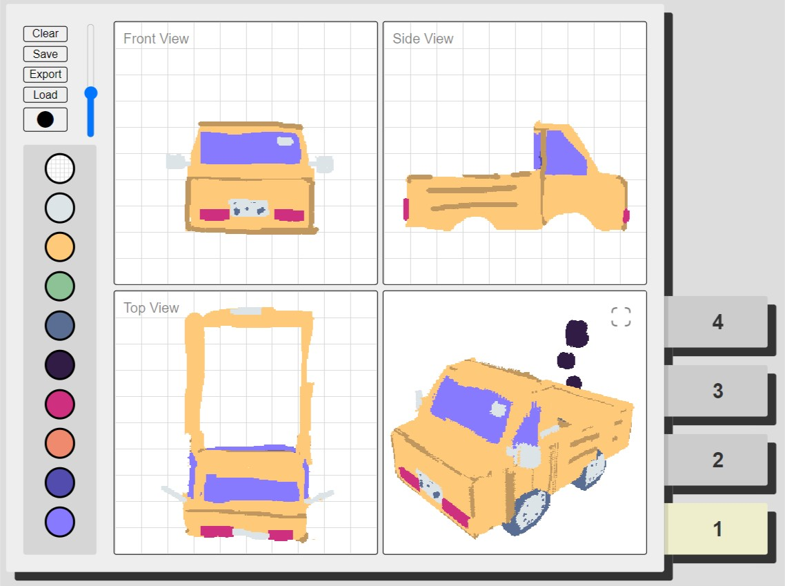

# Itmas - Three-View 3D modeling software

This software creates 3D models by intersecting a top, front, and side view. By combining this with layers, you can create complex geometry easily simply by drawing from different directions.

[Try it now!](https://tesseractc.at/itmas/)

## Additional info

The name *Itmas* comes from the fact that it's "impossible to model a sphere". Intersecting three circles gives you a 'Steinmetz solid' and not a sphere.

The 'export' button allows you to export a `.vox` model, which is used in voxel software such as MagicaVoxel.
